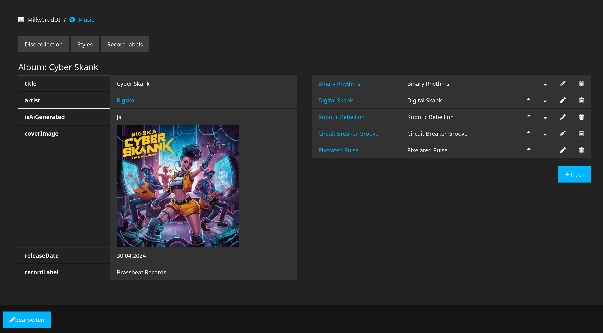
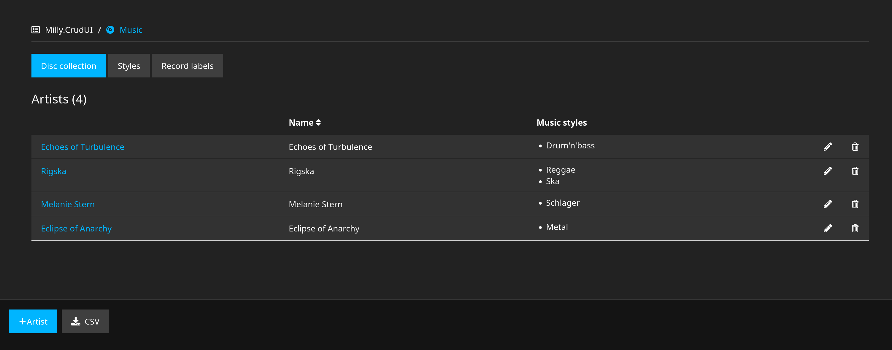
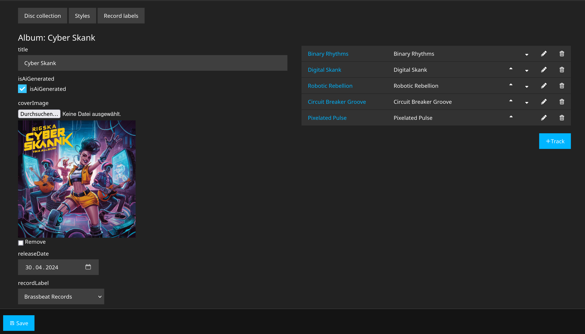

# Milly.CrudUI

Build administration UIs for Neos.Flow entities


Example Neos backend UI from [Milly.CrudUI.Showcase](https://github.com/Kleisli/Milly.CrudUI.Showcase)

## Model-View-Controller
### Domain Model and Repository
With Milly.CrudUI you can manage any flow entity.

#### Customize models
- [Make the entities sortable](Documentation/Domain.md#sorting)

### Views
Milly.CrudUI loads default fusion templates out of the box, but you can create your own, if 
you want to add custom elements.


Example index view from [Milly.CrudUI.Showcase](https://github.com/Kleisli/Milly.CrudUI.Showcase)


Example edit view with Tracks as relation from [Milly.CrudUI.Showcase](https://github.com/Kleisli/Milly.CrudUI.Showcase)


Example creation view from [Milly.CrudUI.Showcase](https://github.com/Kleisli/Milly.CrudUI.Showcase)

#### Customize views
- [Apply custom styles with theming](Documentation/Views.md#theming)
- [Add custom fusion templates](Documentation/Views.md#custom-templates)


### Controller
Milly.CrudUI can be used for Neos backend modules or with regular ActionControllers to provide 
crud functionality to frontend users.

Neos backend module
```
class MyModelController extends AbstractModuleController
{
    use CrudControllerTrait;
}
```

For Neos frontend or in plain Flow applications
```
class MyModelController extends ActionController
{
    use CrudControllerTrait;
}
```

#### Customize controllers
- [Refer to a mismatching Model Namespace](Documentation/Controller.md#mismatching-model-namespace)
- [Select the crud functionalities to add](Documentation/Controller.md#select-the-functionalities-to-add)


## Configuration
Configuration Settings have to be defined for each model. A Model `MyModel` is defined in the configuration file 
`Configuration/Settings.CrudUI.MyModel.yaml`

```
Milly:
  CrudUI:
    entities:
      <MyVendor\MyPackage\Domain\Model\MyModel>:
        readonly: true
        label:
          one: 'My model'
          many: 'My models'
        parent: 'parentProperty'
        views: []
        properties: []
        relations: []
```
### Labels
- `label` : Singular and plural form of how the entity class is labelled in the UI

### Parent
- `parent` : If you want to manage nested structures, you can set a property, that is a reference the parent of the current model.
            The parent model must have a configured `relation` to the child model. 


### Views-Configuration
For each view, an array of properties that should be rendered can be defined.

```
views:
    index:
        properties: [<textProperty>, <imageProperty>]
    show:
        properties: []
    edit:
        properties: []
    relation:
        properties: []
    export:
        properties: []
```
Configuration of the view `relation` specifies what properties of a model are displayed when it is shown as relation in the 
`show` view of the `parent` model.

The views configuration are optional. When no views configuration exists for a view, all properties are displayed 
and the default settings are applied.

#### Customize views-configuration
- [column headers for  `index` and `relation`](Documentation/Configuration.md#show-column-headers)
- [pagination for `index`](Documentation/Configuration.md#pagination)
- [filter options for `index`](Documentation/Configuration.md#filters) 
- [orderBy options for `index`](Documentation/Configuration.md#orderBy)


### Properties-Configuration
To make a property displayable or editable with Milly.CrudUI it has to be added as a key to the `properties` configuration.

```
properties:
  <textProperty>: []
  <titleProperty>:
    label: 'Title'
    readonly: true
```
- `label` : how the property is labelled in the UI

If there is no property configuration
- the default type `string` is used
- the label will be fetched from the xlf file `Model/MyModel.xlf` with the property name as trans-unit id. see [MyModel.xlf](Documentation/Examples/MyModel.xlf) for an example.
    - if there is no such file or key, the property name will be used as label

```
properties:
    <imageProperty>:
        type: image
    <entityProperty>:
        type: select
        options:
            repository: MyVendor\MyPackage\Domain\Repository\MyEntityRepository
```

PropertyEditors provide form fields to edit properties and PropertyDisplayers are used to display properties values.
There are several built-in combinations of PropertyEditor and PropertyDisplayer defined by a `type`. 
For some types there are `options` that can or have to be defined.

The following property types exist. For more details, see the detailed list of [Property Types](Documentation/PropertyTypes.md)
- `string` (default)
- `textarea`
- `number`
- `email`
- `select` for ManyToOne properties
- `multiSelect` for OneToMany or ManyToMany properties
- `booleanRadio` for boolean properties
- `booleanCheckbox` for boolean properties
- `date` for DateTime properties
- `dateTime` for DateTime properties
- `dateInterval` for DateInterval properties
- `image` for `\Neos\Flow\ResourceManagement\PersistentResource` properties
- `audio` for `\Neos\Flow\ResourceManagement\PersistentResource` properties
- `jsonList` for array properties annotated with `@ORM\Column(type="flow_json_array")`


#### Customize properties-configuration
- [Map properties (e.g. of connected entities)](Documentation/Configuration.md#map-properties-of-connected-entities)
- [Add custom property editors and displayers](Documentation/Configuration.md#add-custom-property-types)

### Relations-Configuration
Technically, a property can also be a relation (see types `select` or `multiSelect`) and relations 
are also properties of the class.

```
relations:
  oneToManyProperty: []
  manyToManyProperty:
    label: 'Many'
    readonly: true
```

The differences in the context of Milly.CrudUI are:
- when configured in `properties`, the user can only choose from existing objects, while in `relations` the user can create
new objects of the relation class
- the list of objects in `relations` can show more than one property of the objects (configured in `views.relation`), 
as `properties` the objects are displayed as list of their labels


## Why Milly?
[Milly Koss](https://en.wikipedia.org/wiki/Milly_Koss) was an American pioneering computer programmer. The Association for Women in Computing awarded her an Ada Lovelace Award in 2000.
> We needed to understand
> how we might reuse tested code and have the machine help in programming. As we
> programmed, we examined the process and tried to think of ways to abstract these
> steps to incorporate them into higher-level language. This led to the development
> of interpreters, assemblers, compilers, and generators—programs designed to operate
> on or produce other programs, that is, automatic programming. (Milly Koss, [Source](https://en.wikipedia.org/wiki/Automatic_programming))
>


## Kudos
This package is based on the idea and inspired by [Sandstorm.CrudForms](https://github.com/sandstorm/CrudForms)

The development of this package has significantly been funded by [Profolio](https://www.profolio.ch/) - a digital platform for career choice & career counseling
